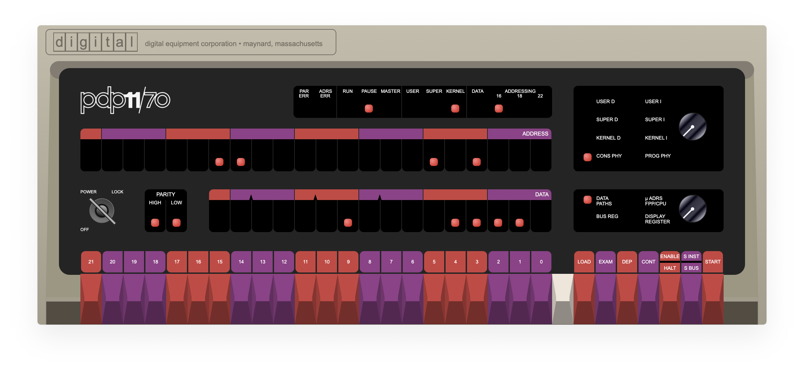
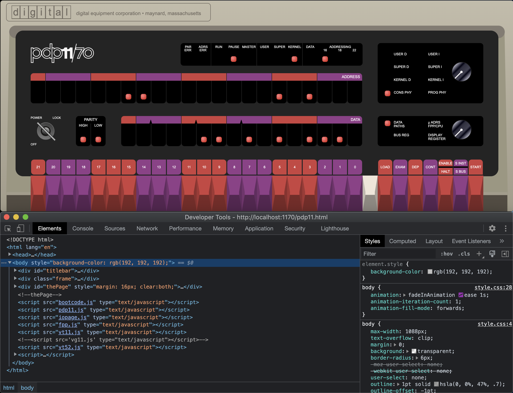
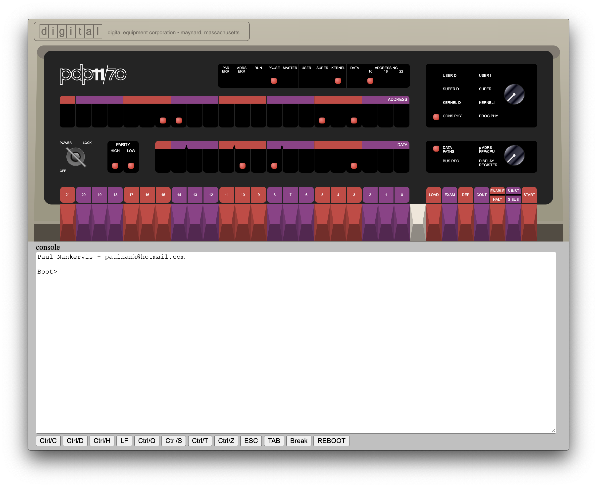

This repository is the home of electron-pdp-11, an electron application based on the work of Paul Nankervis.



The full story can be found on his website:  https://skn.noip.me/pdp11/pdp11.html

His entire archive of the PDP-11/70 and PDP-11/45 can be downloaded from:  https://skn.noip.me/pdp11/pdp11.zip

This Electron app builds on the basis files contained within this zip file.  Also, since Electron is based on Chrome, a full fledge web debugger is automatically included with the application.  You can test this by clicking Command-Option-I on macOS, or Control-Shift-I on Windows systems.



For the following discussion, it is assumed the reader has knowledge of Electron, Node, and NPM and also has all three installed on their system...

## How does it work?

The app uses the express node module to serve files contained within the pdp11 folder of the Electron application.  This includes the main page pdp11.html, and the OS disk images (*.dsk) within the folder.

Electron starts and initiates express server by listening on TCP/IP port 1170 for the PDP-11/70, or TCP/IP port 1145 for the PDP-11/45.  Electron then loads the URL of the main page via HTTP request to
```
http://localhost:1170/pdp11.html
```
or
```
http://localhost:1145/pdp11-45.html
```
depending on model of mini computer.


## Get Up & Running

Choose your platform and model, then copy the corresponding folder to a destination of your choice.

Unzip the files from the pdp11.zip archive downloaded from Paul Nankervis' website to the pdp11 folder contained within top level of the Electron application folder.

## *** IMPORTANT ***
Do not overwrite the existing pdp11.html or pdp11-45.html, as these have been modified slightly to allow for the enhancements, such as the Windows 10 title bar, window drag region, and slide down console.

## Exactly what was modified?
Here is the list:

Stylesheet allows for additional formatting control in coordination with electron application.
```
<link rel="stylesheet" href="style.css" type="text/css">
```
Add Window 10 style title bar, allowing for window placement anywhere on screen.  Original contributor is Ronnie Dutta.  Updated IPCRenderer implementation code and drag region support added by yours truly.
```
<div id="titlebar">
</div>
```
Affords better control of the documentation section of the page, allowing the console and documentation to scroll under the main control panel.
```
<div id="thePage" style="margin: 16px; clear:both;">
</div>
```
Clickable area which toggles view of the console/documentation panel.  On macOS, the console tray is animated.  Unfortunately, on Windows, animation has not yet been implemented for Electron.
```
<div id="console"></div>
```


Disabling of onfocus for console, which shifted the rendered HTML to top of page.
```
//document.getElementById('0').focus();
```

## Implementation

CD into the top level of your destination folder and run the following to install node dependancies:
```
npm init
```
Start the electron application via:
```
npm start
```
To package the electron application using electron-packager, use the provided x64.sh or x64.cmd script.

Some usage notes:

On macOS systems, if you hover your mouse over the upper left corner, the macOS traffic light control buttons will become visible.

On Windows systems, if you hover your mouse over the upper right corner, the Windows 10 title bar style control buttons will become visible.

Hovering the mouse over the lower right of the front panel, the mouse cursor will change indicating that a click will open/close the console panel.

Clicking this area toggles view of the console used to boot the various disk images, and also displays the documentation which can be viewed by scrolling the page.

If all goes according to plan/instructions, you should have your very own self-contained, working, DEC PDP-11 mini computer available to you on call and on your desktop for your viewing pleasure!

Enjoy!


Copyright © 2022 telemark software, llc.  All rights reserved.